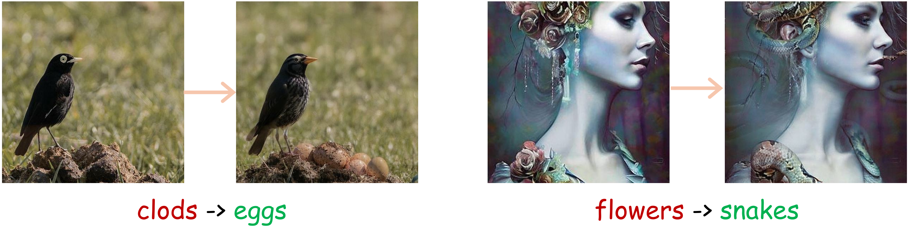

<!-- <h1 align="center">Coarse-guided-Gen</h1> -->
<h2 align="center">Coarse-Guided Visual Generation via Weighted h-Transform Sampling</h2>
<p align="center">
  <a href="https://wang-yanghao.github.io/">Yanghao Wang</a><sup>*</sup> ·
  <a href="https://ziqi-jiang.github.io/">Ziqi Jiang</a><sup>*</sup> ·
  <a href="https://zhenwang97.github.io/">Zhen Wang</a> ·
  <a href="https://zjuchenlong.github.io/">Long Chen</a><sup>†</sup>
</p>
<p align="center"><sup>*</sup> Equal contribution</p>

<p align="center">
  <a href="https://arxiv.org/pdf/2603.12057">
    
  </a>
</p>

<h4 align="center">Image Restoration</h4>

<p align="center">

</p>


<h4 align="center">Image Editing</h4>

<p align="center">

</p>

<h4 align="center">Camera-controlled Video Generation</h4>
  <br/>
  <br/>


<h3 align="center">Achieve various conditional visual generation guided by a coarse sample with 1 line of code.</h3>


<!-- ## Abstract
We propose a novel guided method by using the $h$-transform, a tool that can constrain the sampling process under desired conditions. Specifically, we modify the transition probability at each sampling timestep by adding to the original differential equation with a drift function, which approximately steers the generation toward the ideal fine sample. To address unavoidable approximation errors, we introduce a noise-level-aware schedule that gradually de-weights the term as the error increases, ensuring both guidance adherence and high-quality synthesis. -->

<br>

## 0. Table of Contents

- [Environment preparation](#1-environment-preparation)
- [Quick start](#2-quick-start)
    - [Coarse image guided generation](#coarse-image-guided-generation)
    - [Coarse video guided generation](#coarse-video-guided-generation)
- [Full run](#3-full-run-complete-datasets-and-evaluation)
  - [Coarse image guided generation](#coarse-image-guided-generation-1)
  - [Coarse video guided generation](#coarse-video-guided-generation-1)
- [TODO](#todo-🛠️)
- [Acknowledgments](#acknowledgments)
- [BibTeX](#bibtex)

<br>

## 1. Environment preparation
```
pip install -r requirements.txt
```
  

<br>

## 2. Quick start

### Coarse image guided generation

We take the image super-resolution task and generate the images for the given eight example images.

```
cd ImageGen
```
Download pretrained checkpoint from the [link](https://drive.google.com/drive/folders/1jElnRoFv7b31fG0v6pTSQkelbSX3xGZh?usp=sharing), download the checkpoint "ffhq_10m.pt" and paste it to ./models/. Then run the code.
```
bash quick_run.sh
```
The result will be stored in the ''VideoGen/outputs/'' path.


### Coarse video guided generation

We generate the video for the given example video.
```
cd ImageGen 
bash quik_run.sh
```
The result will be stored in the ''ImageGen/outputs/'' path.

<br>


## 3. Full run (complete datasets and evaluation)
### Coarse image guided generation
```
cd ImageGen
```
Preprare the complete datasets.
```
wget -P ./data/ https://github.com/HKUST-LongGroup/Coarse-guided-Gen/releases/download/datasets/ffhq_256.zip
unzip ./data/ffhq_256.zip
```
Full experiments including the evaluation.
```
bash full_run.sh
```
The result will be stored in the ''ImageGen/outputs/'' path. 

You can change the hyperparameter $\alpha$ in the 3rd line of ''full_run.sh''.


### Coarse video guided generation
```
cd VideoGen
```
Preprare the complete datasets.
```
wget -P ./data/ https://github.com/HKUST-LongGroup/Coarse-guided-Gen/releases/download/datasets/datasets_cog.zip
unzip ./data/datasets_cog.zip
wget -P ./data/ https://github.com/HKUST-LongGroup/Coarse-guided-Gen/releases/download/datasets/datasets_wan.zip
unzip ./data/datasets_wan.zip
```
Full experiments including the evaluation.
```
bash full_run.sh
```
The result will be stored in the ''VideoGen/outputs/'' path. 

You can change the hyperparameters $\alpha_1$ and $\alpha_2$ in ''full_run.sh''.


<br>


## TODO 🛠️

- [x] Image restoration run code
- [x] Camera-controlled video generation run code
- [x] Quick start examples
- [x] Complete datasets release
- [x] Evaluation code
- [ ] Coarse videos construcation code
- [ ] Image editing code


<br>


## Acknowledgments

The codebases are built on top of [DPS](https://github.com/DPS2022/diffusion-posterior-sampling) and [TTM](https://github.com/time-to-move/TTM).
Thanks very much.


<br>


## BibTex
```
@article{wang2026coarse,
  title={Coarse-Guided Visual Generation via Weighted h-Transform Sampling},
  author={Wang, Yanghao and Jiang, Ziqi and Wang, Zhen and Chen, Long},
  journal={arXiv preprint arXiv:2603.12057},
  year={2026}
}
```